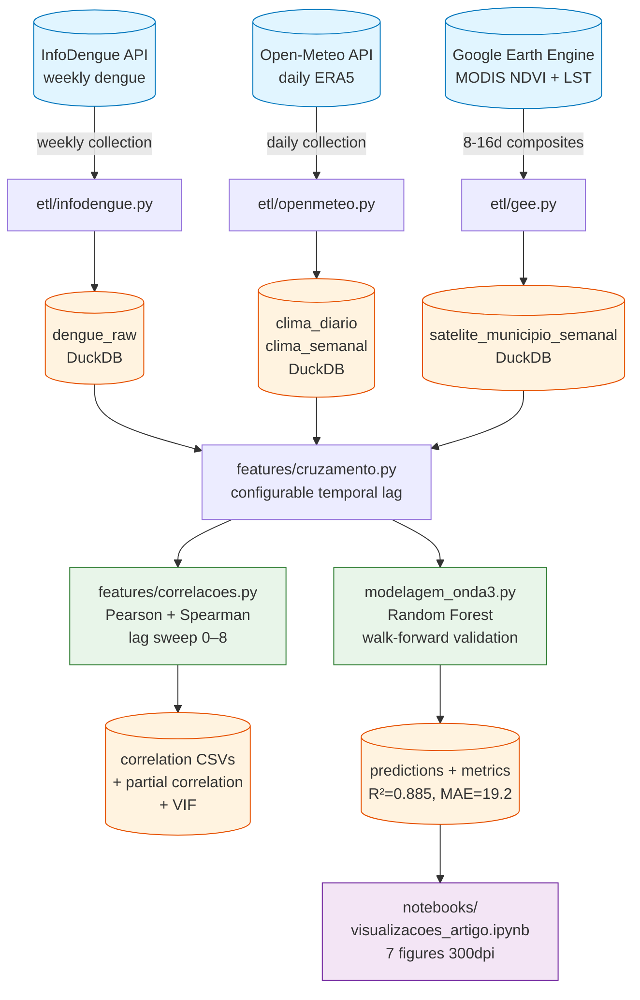

# Dengue × Climate Observatory — Maringá

> End-to-end analytical pipeline: automated collection of epidemiological, climate, and remote sensing data, lag-based correlation analysis, and dengue predictive model — applied to Maringá-PR, Brazil (2020–2025).

[🇧🇷 Português](./README.md) · 🇬🇧 **English** (you are here)

---


## Overview

Maringá-PR faces recurrent dengue epidemics with marked seasonal peaks. Epidemiological literature suggests that climate factors with temporal lag (precipitation, temperature, humidity) are predictors of case incidence, reflecting the *Aedes aegypti* development cycle plus the disease incubation period.

This project builds a **reproducible data pipeline** that:

1. **Collects** data from 3 open sources (InfoDengue, Open-Meteo ERA5, Google Earth Engine MODIS)
2. **Joins** dengue × climate × satellite with configurable temporal lag
3. **Validates** statistically which variables are independent predictors
4. **Predicts** weekly incidence with Random Forest, outperforming the baseline by 27.5%

**Period:** 314 epidemiological weeks (2020–2025) · **Resolution:** weekly · **Municipality:** Maringá-PR (IBGE 4115200)

## Key Results

### Predictive model (Random Forest, walk-forward validation)

| Metric | Baseline (4-week Moving Average) | Random Forest |
|---|:---:|:---:|
| MAE | 26.5 | **19.2** |
| RMSE | 46.1 | **38.6** |
| R² | 0.835 | **0.885** |
| MAPE | 37.1% | **25.6%** |

The Random Forest outperforms the moving average baseline across **all years** in the validation period (2021–2025), with a 27.5% reduction in mean absolute error.

### Climate × dengue correlations (Spearman, 314 weeks)

| Variable | Source | Optimal lag | ρ | p-value |
|---|---|:---:|:---:|:---:|
| Nighttime LST | MODIS (satellite) | 8 wk | **0.540** | < 10⁻²³ |
| Min. Temperature | ERA5 (climate) | 8 wk | **0.519** | < 10⁻²² |
| Mean Temperature | ERA5 (climate) | 8 wk | 0.408 | < 10⁻¹³ |
| NDVI | MODIS (satellite) | 6 wk | 0.388 | < 10⁻¹² |
| Relative Humidity | ERA5 (climate) | 8 wk | 0.333 | < 10⁻⁹ |
| Precipitation | ERA5 (climate) | 8 wk | 0.251 | < 10⁻⁵ |

### Feature validation (partial correlation and VIF)

| Feature | Partial corr. (controlling others) | VIF | Decision |
|---|:---:|:---:|---|
| Min. Temperature (ERA5) | r = 0.489, p < 0.001 | 7.8 | ✅ Included |
| NDVI (MODIS) | r = 0.327, p < 0.001 | 1.0 | ✅ Included |
| Nighttime LST (MODIS) | r = 0.039, p = 0.505 | 7.8 | ❌ Dropped (redundant with min. temperature) |

Minimum temperature and NDVI contribute **independently** to dengue prediction. Nighttime LST, despite a strong bivariate correlation, is redundant with minimum temperature (VIF = 7.8, non-significant partial correlation).

### Feature importance in the final model

| Feature | Type | Importance (Gini) |
|---|---|:---:|
| Previous week cases | Autoregressive | 0.976 |
| Min. Temperature (lag 8) | Climate ERA5 | 0.006 |
| NDVI (lag 8) | Satellite MODIS | 0.002 |
| Cases 2–4 wk ago | Autoregressive | 0.016 |

In the short term (1 week ahead), case autocorrelation dominates. Climate features contribute marginally but are retained because: (a) they provide a real statistical gain in R², (b) they carry epidemiological relevance, (c) they have potential for medium-range forecasting (4–8 weeks) where autocorrelation loses power.

## Architecture



## How It Works

**1. Dengue collection (InfoDengue API).** Weekly data for Maringá over 2020–2025 (314 weeks). Notified and estimated cases (with nowcasting), alert level, and incidence per 100,000 inhabitants. The API limits requests to 1 year each — the collector iterates automatically.

**2. Climate collection (Open-Meteo Archive API).** Daily ERA5 reanalysis data at Maringá coordinates: mean/max/min temperature, accumulated precipitation, and relative humidity. Aggregated to ISO 8601 epidemiological weeks using `epiweeks`, respecting years with 53 weeks.

**3. Satellite collection (Google Earth Engine).** NDVI from MOD13Q1 (16-day composites, forward-filled to daily series) and nighttime LST from MOD11A1 (daily, Kelvin→Celsius conversion). Municipality geometry via GAUL (FAO). Weekly aggregation reuses the same function as climate data.

**4. Persistence.** All data stored in DuckDB (embedded analytical database) across 4 tables: `dengue_raw`, `clima_diario`, `clima_semanal`, `satelite_municipio_semanal`. Ad-hoc SQL queries available via `database.carregar()`.

**5. Lag-based join.** Dengue and climate/satellite are joined by `(ano_epi, semana_epi)` with configurable temporal lag (default: 8 weeks). Lag arithmetic uses `epiweeks` so year boundaries respect the ISO calendar.

**6. Correlation analysis.** Systematic sweep of lags 0–8 weeks × all variables × Pearson + Spearman. Partial correlation and VIF to validate feature independence. Temporal stability verified year by year.

**7. Predictive modeling.** Random Forest with walk-forward validation (train on the past, predict the future — no data leakage). Three models compared: baseline (4-week moving average), RF climate-only, RF climate + autoregressive. Final features: `temperature_2m_min_lag8`, `ndvi_lag8`, `casos_lag1..4`.

## Project Structure

```
observatorio-dengue/
├── src/observatorio_dengue/
│   ├── config.py                  # Typed configuration (Pydantic)
│   ├── etl/
│   │   ├── infodengue.py          # InfoDengue API collector
│   │   ├── openmeteo.py           # Open-Meteo collector + weekly aggregation
│   │   ├── gee.py                 # GEE collector (NDVI + LST_Night)
│   │   └── database.py            # DuckDB: schema, persistence, queries
│   └── features/
│       ├── cruzamento.py          # Dengue × climate join with lag
│       └── correlacoes.py         # Pearson, Spearman, lag sweep
├── scripts/
│   ├── coleta_expandida_2020_2025.py   # Full collection from all 3 sources
│   ├── smoke_correlacoes.py            # Smoke test: climate correlations
│   ├── smoke_correlacoes_v2.py         # Smoke test: climate + satellite
│   ├── smoke_gee.py                    # Smoke test: GEE end-to-end
│   ├── analise_ndvi_temperatura.py     # NDVI × temperature partial correlation
│   ├── validacao_features.py           # VIF, stability, recommendation
│   └── modelagem_onda3.py             # RF walk-forward validation
├── notebooks/
│   └── visualizacoes_artigo.ipynb      # 7 publication-ready figures (300dpi)
├── reports/figuras/                    # PNGs exported from notebook
├── tests/                             # 73 tests (pytest)
├── data/processed/                    # DuckDB + result CSVs
└── pyproject.toml
```

## Local Setup

**Requirements:** Python 3.12+, [`uv`](https://docs.astral.sh/uv/getting-started/installation/), Git, GEE account (for satellite data).

```bash
# Clone
git clone https://github.com/220719/observatorio-dengue.git
cd observatorio-dengue

# Install dependencies
uv sync --all-extras
uv pip install -e .

# Run tests (73 tests)
uv run pytest -v

# Full 2020–2025 collection (requires live APIs)
uv run python scripts/coleta_expandida_2020_2025.py

# Feature validation
uv run python scripts/validacao_features.py

# Predictive modeling
uv run python scripts/modelagem_onda3.py

# Visualizations (open in VS Code / Jupyter)
jupyter notebook notebooks/visualizacoes_artigo.ipynb
```

## Tech Stack

| Layer | Technologies |
|---|---|
| **Language** | Python 3.12, `uv` |
| **Configuration** | Pydantic + pydantic-settings |
| **Data** | DuckDB, Pandas |
| **Climate** | Open-Meteo Archive API (ERA5) |
| **Epidemiology** | InfoDengue API, epiweeks (ISO 8601) |
| **Remote sensing** | Google Earth Engine (earthengine-api), MODIS MOD13Q1 + MOD11A1 |
| **Statistics** | SciPy (Pearson, Spearman, partial correlation, VIF) |
| **Modeling** | scikit-learn (Random Forest, walk-forward) |
| **Visualization** | Matplotlib, Seaborn (300dpi figures) |
| **Quality** | pytest (73 tests), Ruff (lint + format), Loguru |
| **Environment** | WSL2 + Ubuntu 24.04, VS Code |

## Roadmap

### ✅ Wave 1 — Dengue × climate pipeline

- [x] Environment setup (WSL2, Python 3.12, uv, VS Code)
- [x] Typed configuration with Pydantic
- [x] InfoDengue collection (`etl/infodengue.py`)
- [x] Open-Meteo collection + weekly aggregation (`etl/openmeteo.py`)
- [x] DuckDB persistence (`etl/database.py`)
- [x] Temporal lag join (`features/cruzamento.py`)
- [x] Pearson + Spearman correlation analysis with lag sweep (`features/correlacoes.py`)

### ✅ Wave 2 — Remote sensing (MODIS via GEE)

- [x] Google Earth Engine setup (academic project `observatorio-dengue-maringa`)
- [x] NDVI collection (MOD13Q1, daily forward-fill → weekly)
- [x] LST_Night collection (MOD11A1, Kelvin → Celsius)
- [x] `satelite_municipio_semanal` table in DuckDB
- [x] Climate + satellite × dengue correlation matrix (126 tests)
- [x] Partial correlation: NDVI and min. temperature are independent
- [x] LST_Night dropped due to multicollinearity (VIF = 7.8)

### ✅ Wave 3 — Predictive model

- [x] Expanded 2020–2025 collection (314 weeks, 3 sources)
- [x] Feature validation with expanded data (VIF, temporal stability)
- [x] Random Forest with walk-forward validation (R² = 0.885)
- [x] Comparison: RF climate+autoregr outperforms baseline across all years
- [x] Notebook with 7 publication-ready figures (300 DPI)


## About the Author

**Anuar Mincache** · PhD in Condensed Matter Physics · Data Scientist

Researcher with a background in rigorous quantitative research (Rietveld refinement of multiferroic perovskites, X-ray and neutron diffraction), applying this technical foundation to public health problems and applied data science in Brazil.

**Institutional affiliations:**
- Universidade Estadual de Maringá (UEM)
- Centro Universitário Ingá (UNINGA)

**Contact:**
- LinkedIn: [anuar-mincache](https://www.linkedin.com/in/anuar-mincache/)
- GitHub: [@220719](https://github.com/220719)
- ORCID: [0000-0001-8528-8020](https://orcid.org/0000-0001-8528-8020)
- Email: [ajmincache2@uem.br](mailto:ajmincache2@uem.br)

## License

[MIT License](./LICENSE) — free to use with attribution.

---

*Project completed (Waves 1–3). Issues, suggestions, and technical critiques are welcome.*
