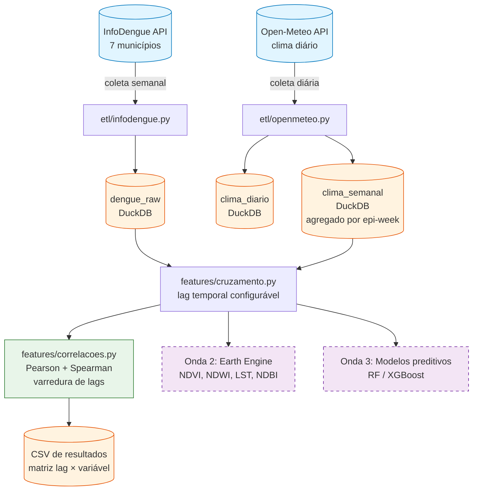

# Observatório Dengue × Clima — Maringá

> Pipeline analítico integrando dados epidemiológicos do InfoDengue, dados climáticos do Open-Meteo e (Onda 2) sensoriamento remoto via Google Earth Engine — para investigar a dinâmica da dengue na região metropolitana de Maringá, PR.

🇧🇷 **Português** (você está aqui) · [🇬🇧 English](./README.en.md) *(em breve)*

---


## Visão geral

Maringá-PR e a região metropolitana enfrentam epidemias recorrentes de dengue. A literatura epidemiológica sugere que **fatores climáticos com defasagem de 3–5 semanas** (precipitação, temperatura, umidade) são preditores razoáveis da incidência de casos — refletindo o ciclo de desenvolvimento do *Aedes aegypti* somado ao período de incubação da doença.

Este projeto constrói um **pipeline de dados reprodutível** para testar essa hipótese sistematicamente, usando exclusivamente fontes abertas. A primeira onda integra dengue + clima; a segunda adicionará sensoriamento remoto (NDVI, NDWI, LST, NDBI) por bairro; a terceira treinará modelos preditivos de risco.

**Status atual:** Onda 1 ✅ concluída — pipeline completo de coleta, persistência, cruzamento e análise de correlações Pearson/Spearman, validado contra dados reais de Maringá em 2024.

## Arquitetura



## Como funciona

**1. Coleta de dengue (InfoDengue API).** Dados semanais de 7 municípios da região (Maringá, Sarandi, Paiçandu, Mandaguari, Marialva, Mandaguaçu, Astorga), no período 2020–2025. Casos notificados e estimados (com nowcasting), nível de alerta e incidência.

**2. Coleta de clima (Open-Meteo Archive API).** Dados diários do reanálise ERA5 nas coordenadas de Maringá: temperatura média/máxima/mínima, precipitação acumulada e umidade relativa.

**3. Agregação semanal.** Dados climáticos diários são agregados para semanas epidemiológicas (ISO 8601) usando a biblioteca `epiweeks`, que respeita anos com 53 semanas. Agregações apropriadas por variável: chuva é somada, demais variáveis usam média.

**4. Persistência.** Tudo é gravado em **DuckDB** (banco analítico embutido) em três tabelas: `dengue_raw`, `clima_diario`, `clima_semanal`. Queries SQL ad-hoc disponíveis via função `carregar()`.

**5. Cruzamento com lag.** Dengue e clima são unidos por `(ano_epi, semana_epi)` aplicando defasagem temporal configurável (default: 4 semanas). O lag é calculado com `epiweeks` para que a virada de ano respeite o calendário ISO real.

## Exemplo de resultado

Dengue de Maringá em 2024 cruzado com clima das 4 semanas anteriores:

| ano_epi | semana_epi | casos | temperatura_média_lag4 (°C) | chuva_lag4 (mm) | umidade_lag4 (%) |
|--------:|-----------:|------:|----------------------------:|----------------:|-----------------:|
|   2024  |          5 | 1.144 |                       26,66 |             6,4 |             63,9 |
|   2024  |          6 | 1.430 |                       27,36 |            22,8 |             68,1 |
|   2024  |          7 | 1.630 |                       26,27 |            49,8 |             79,3 |
|   2024  |          8 | 1.823 |                       21,86 |            32,4 |             75,7 |
|   2024  |          9 | 1.867 |                       26,24 |             0,9 |             60,0 |
|   2024  |         10 | 2.112 |                       27,77 |             7,1 |             60,7 |

Cada linha mostra os casos observados em uma semana, junto com o clima de 4 semanas antes. O padrão sugere que **chuva acumulada e umidade alta nas semanas 3–5 da temporada precedem o pico de casos das semanas 7–10** — consistente com o ciclo de desenvolvimento do vetor.

## Resultados preliminares (Maringá, 2024)

A varredura sistemática de defasagens (lags 0 a 8 semanas) usando `features/correlacoes.py` revela quais variáveis climáticas melhor antecipam a incidência de dengue. Os resultados abaixo correspondem a 52 semanas epidemiológicas de 2024:

| Variável climática | Método | Lag ótimo | r | p-valor | n |
|---|:---:|:---:|:---:|:---:|:---:|
| `temperature_2m_min` | Pearson | **6 sem** | **0,593** | < 0,001 | 46 |
| `relative_humidity_2m_mean` | Spearman | **8 sem** | **0,560** | < 0,001 | 44 |
| `relative_humidity_2m_mean` | Pearson | 4 sem | 0,471 | 0,0007 | 48 |
| `temperature_2m_max` | Pearson | 7 sem | 0,350 | 0,018 | 45 |
| `precipitation_sum` | Pearson | 4 sem | 0,288 | 0,047 | 48 |

**Três achados:**

1. **Temperatura mínima é o melhor preditor linear** (r ≈ 0,59 em lag 6 semanas). Coerente com a biologia do *Aedes aegypti*: noites quentes aceleram o desenvolvimento larval e adulto — uma noite fria mata mosquitos, mas uma média alta com noites frias não compensa.

2. **Umidade tem efeito não-linear monotônico.** Spearman lag 8 (0,56) > Pearson lag 8 (0,42), indicando saturação ou efeito limiar — sinal a ser explorado na Onda 3 com transformações ou modelos não-lineares.

3. **Precipitação total é proxy fraco** (|r| < 0,3). O que provavelmente importa não é chuva acumulada, mas **regularidade e criadouros persistentes** — motivo para feature engineering futuro (chuva de N semanas anteriores, dias com chuva > 5 mm, etc).

A janela de antecedência de 6–8 semanas é compatível com o uso operacional do modelo: tempo suficiente para mobilização de resposta sanitária pela prefeitura.

> Reprodução: `uv run python scripts/smoke_correlacoes.py` — recoleta clima 2024, roda toda a varredura e salva `data/processed/correlacoes_maringa_2024.csv`.

## Stack técnica

**Núcleo:**
- Python 3.12, [`uv`](https://docs.astral.sh/uv/) (gerenciamento de dependências)
- [`pydantic`](https://docs.pydantic.dev/) + [`pydantic-settings`](https://docs.pydantic.dev/latest/concepts/pydantic_settings/) (config tipada)
- [`duckdb`](https://duckdb.org/) (banco analítico embutido)
- [`pandas`](https://pandas.pydata.org/), [`polars`](https://pola.rs/) (DataFrames)
- [`epiweeks`](https://epiweeks.readthedocs.io/) (semanas epidemiológicas ISO 8601)
- [`requests`](https://requests.readthedocs.io/) (HTTP), [`loguru`](https://loguru.readthedocs.io/) (logging)

**Qualidade:**
- [`pytest`](https://docs.pytest.org/) (44 testes unitários e de integração)
- [`ruff`](https://docs.astral.sh/ruff/) (lint + format)
- [`mypy`](https://mypy.readthedocs.io/) (type checking estático)

**Onda 2 (planejada):**
- [`earthengine-api`](https://developers.google.com/earth-engine), [`geemap`](https://geemap.org/), [`geopandas`](https://geopandas.org/), [`rasterio`](https://rasterio.readthedocs.io/)

**Onda 3 (planejada):**
- [`scikit-learn`](https://scikit-learn.org/), [`xgboost`](https://xgboost.readthedocs.io/), [`shap`](https://shap.readthedocs.io/)

## Setup local

**Requisitos:** Python 3.12+, [`uv`](https://docs.astral.sh/uv/getting-started/installation/), Git.

```bash
# Clonar
git clone https://github.com/220719/observatorio-dengue.git
cd observatorio-dengue

# Instalar dependências (cria .venv automaticamente)
uv sync --all-extras
uv pip install -e .

# Rodar testes
uv run pytest -v

# Smoke test do pipeline completo (chama APIs reais)
uv run python -c "
from datetime import date
from observatorio_dengue.config import dengue_config
from observatorio_dengue.etl.database import criar_schema, salvar_dengue
from observatorio_dengue.etl.infodengue import coletar_municipio
criar_schema()
df = coletar_municipio(geocode=4115200, nome_municipio='Maringá', ano_inicio=2024, ano_fim=2024)
salvar_dengue(df)
print(f'{len(df)} semanas de Maringá 2024 inseridas no DuckDB')
"
```

## Estrutura do projeto       

## Roadmap

### ✅ Onda 1 — Núcleo dengue × clima (em curso)

- [x] Setup do ambiente (WSL2, Python 3.12, uv, VS Code)
- [x] Configuração tipada com Pydantic
- [x] Coleta InfoDengue (`etl/infodengue.py`)
- [x] Coleta Open-Meteo + agregação semanal (`etl/openmeteo.py`)
- [x] Persistência em DuckDB (`etl/database.py`)
- [x] Cruzamento com lag temporal (`features/cruzamento.py`)
- [x] Análise de correlação Pearson + Spearman com varredura de lags (`features/correlacoes.py`)
- [ ] Notebook de exploração reproduzindo o trabalho original
- [ ] Heatmap de correlações (lag × variável) para `reports/`

### 🚧 Onda 2 — Sensoriamento remoto (planejada)

- [ ] Setup Google Earth Engine
- [ ] Shapefile de bairros de Maringá
- [ ] Extração de NDVI, NDWI, MNDWI, LST, NDBI por bairro
- [ ] Tabela `satelite_bairro_semanal`
- [ ] Mapas choropleth de risco

### 🔮 Onda 3 — Modelo preditivo (planejada)

- [ ] Engenharia de features (lags múltiplos, indicadores temporais)
- [ ] Random Forest / XGBoost com validação temporal
- [ ] Análise SHAP de importância de features
- [ ] Dashboard Streamlit com previsão de risco

## Sobre o autor

**Anuar Mincache** · Doutor em Física da Matéria Condensada · Cientista de Dados

Pesquisador com formação em pesquisa quantitativa rigorosa (refinamento Rietveld de perovskitas multiferróicas, difração de raios X e nêutrons), aplicando essa base técnica para problemas de saúde pública, dados governamentais e ciência de dados aplicada ao Brasil.

**Vínculos institucionais:**
- Universidade Estadual de Maringá (UEM)
- Centro Universitário Ingá (UNINGA)

**Contato:**
- LinkedIn: [anuar-mincache](https://www.linkedin.com/in/anuar-mincache/)
- GitHub: [@220719](https://github.com/220719)
- ORCID: [0000-0001-8528-8020](https://orcid.org/0000-0001-8528-8020)
- Email: [ajmincache2@uem.br](mailto:ajmincache2@uem.br)

## Licença

Este projeto é distribuído sob a [Licença MIT](./LICENSE) — você pode usar, modificar, distribuir e usar comercialmente, desde que mantenha o aviso de copyright e a licença.

---

*Projeto em desenvolvimento ativo. Issues, sugestões e críticas técnicas são bem-vindas.*
