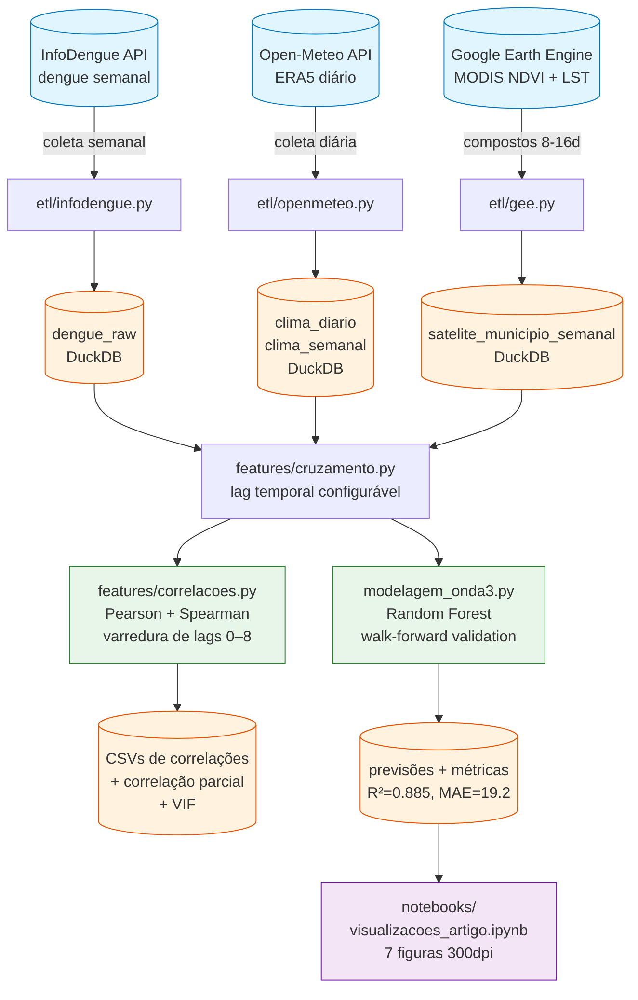

# Observatório Dengue × Clima — Maringá

> Pipeline analítico end-to-end: coleta automatizada de dados epidemiológicos, climáticos e de sensoriamento remoto, análise de correlação com defasagem temporal, e modelo preditivo de dengue — aplicado à região de Maringá-PR (2020–2025).

🇧🇷 **Português** (você está aqui) · [🇬🇧 English](./README.en.md) *(em breve)*

---


## Visão geral

Maringá-PR enfrenta epidemias recorrentes de dengue com picos sazonais marcantes. A literatura epidemiológica sugere que fatores climáticos com defasagem temporal (precipitação, temperatura, umidade) são preditores da incidência de casos, refletindo o ciclo de desenvolvimento do *Aedes aegypti* somado ao período de incubação da doença.

Este projeto constrói um **pipeline de dados reprodutível** que:

1. **Coleta** dados de 3 fontes abertas (InfoDengue, Open-Meteo ERA5, Google Earth Engine MODIS)
2. **Cruza** dengue × clima × satélite com defasagem temporal configurável
3. **Valida** estatisticamente quais variáveis são preditores independentes
4. **Prevê** incidência semanal com Random Forest, superando o baseline em 27.5%

**Período:** 314 semanas epidemiológicas (2020–2025) · **Resolução:** semanal · **Município:** Maringá-PR (IBGE 4115200)

## Principais resultados

### Modelo preditivo (Random Forest, walk-forward validation)

| Métrica | Baseline (Média Móvel 4 sem) | Random Forest |
|---|:---:|:---:|
| MAE | 26.5 | **19.2** |
| RMSE | 46.1 | **38.6** |
| R² | 0.835 | **0.885** |
| MAPE | 37.1% | **25.6%** |

O Random Forest supera o baseline de média móvel em **todos os anos** do período de validação (2021–2025), com ganho de 27.5% no erro absoluto médio.

### Correlações clima × dengue (Spearman, 314 semanas)

| Variável | Fonte | Lag ótimo | ρ | p-valor |
|---|---|:---:|:---:|:---:|
| LST Noturna | MODIS (satélite) | 8 sem | **0.540** | < 10⁻²³ |
| Temp. Mínima | ERA5 (clima) | 8 sem | **0.519** | < 10⁻²² |
| Temp. Média | ERA5 (clima) | 8 sem | 0.408 | < 10⁻¹³ |
| NDVI | MODIS (satélite) | 6 sem | 0.388 | < 10⁻¹² |
| Umid. Relativa | ERA5 (clima) | 8 sem | 0.333 | < 10⁻⁹ |
| Precipitação | ERA5 (clima) | 8 sem | 0.251 | < 10⁻⁵ |

### Validação das features (correlação parcial e VIF)

| Feature | Parcial (controlando as outras) | VIF | Decisão |
|---|:---:|:---:|---|
| Temp. Mínima (ERA5) | r = 0.489, p < 0.001 | 7.8 | ✅ Incluída |
| NDVI (MODIS) | r = 0.327, p < 0.001 | 1.0 | ✅ Incluída |
| LST Noturna (MODIS) | r = 0.039, p = 0.505 | 7.8 | ❌ Descartada (redundante com temp. mínima) |

A temperatura mínima e o NDVI contribuem de forma **independente** para a predição de dengue. A LST noturna, apesar de forte correlação bivariada, é redundante com a temperatura mínima (VIF = 7.8, correlação parcial não significativa).

### Importância das features no modelo final

| Feature | Tipo | Importância (Gini) |
|---|---|:---:|
| Casos semana anterior | Autorregressiva | 0.976 |
| Temp. Mínima (lag 8) | Clima ERA5 | 0.006 |
| NDVI (lag 8) | Satélite MODIS | 0.002 |
| Casos 2–4 sem. atrás | Autorregressiva | 0.016 |

No curto prazo (1 semana), a autocorrelação dos casos domina. As features climáticas contribuem marginalmente mas são mantidas por: (a) ganho estatístico real no R², (b) relevância epidemiológica, (c) potencial para previsão de médio prazo (4–8 semanas) onde a autocorrelação perde poder.

## Arquitetura



## Como funciona

**1. Coleta de dengue (InfoDengue API).** Dados semanais de Maringá no período 2020–2025 (314 semanas). Casos notificados e estimados (com nowcasting), nível de alerta e incidência por 100 mil habitantes. A API limita 1 ano por requisição — o coletor itera automaticamente.

**2. Coleta de clima (Open-Meteo Archive API).** Dados diários do reanálise ERA5 nas coordenadas de Maringá: temperatura média/máxima/mínima, precipitação acumulada e umidade relativa. Agregação para semanas epidemiológicas ISO 8601 usando `epiweeks`, respeitando anos com 53 semanas.

**3. Coleta de satélite (Google Earth Engine).** NDVI do MOD13Q1 (compostos 16 dias, forward-fill para série diária) e LST noturna do MOD11A1 (diário, conversão Kelvin→Celsius). Geometria do município via GAUL (FAO). Agregação semanal reusando a mesma função do clima.

**4. Persistência.** Tudo gravado em DuckDB (banco analítico embutido) em 4 tabelas: `dengue_raw`, `clima_diario`, `clima_semanal`, `satelite_municipio_semanal`. Queries SQL ad-hoc disponíveis via `database.carregar()`.

**5. Cruzamento com lag.** Dengue e clima/satélite são unidos por `(ano_epi, semana_epi)` com defasagem temporal configurável (default: 8 semanas). O lag é calculado com `epiweeks` para que a virada de ano respeite o calendário ISO.

**6. Análise de correlação.** Varredura sistemática de lags 0–8 semanas × todas as variáveis × Pearson + Spearman. Correlação parcial e VIF para validar independência das features. Estabilidade temporal verificada ano a ano.

**7. Modelagem preditiva.** Random Forest com walk-forward validation (treina no passado, prevê o futuro — sem data leakage). Três modelos comparados: baseline (média móvel 4 sem), RF só clima, RF clima + autorregressivo. Features finais: `temperature_2m_min_lag8`, `ndvi_lag8`, `casos_lag1..4`.

## Estrutura do projeto

```
observatorio-dengue/
├── src/observatorio_dengue/
│   ├── config.py                  # Configuração tipada (Pydantic)
│   ├── etl/
│   │   ├── infodengue.py          # Coleta InfoDengue API
│   │   ├── openmeteo.py           # Coleta Open-Meteo + agregação semanal
│   │   ├── gee.py                 # Coleta GEE (NDVI + LST_Night)
│   │   └── database.py            # DuckDB: schema, persistência, queries
│   └── features/
│       ├── cruzamento.py          # Cruzamento dengue × clima com lag
│       └── correlacoes.py         # Pearson, Spearman, varredura de lags
├── scripts/
│   ├── coleta_expandida_2020_2025.py   # Coleta completa das 3 fontes
│   ├── smoke_correlacoes.py            # Smoke test: correlações clima
│   ├── smoke_correlacoes_v2.py         # Smoke test: clima + satélite
│   ├── smoke_gee.py                    # Smoke test: GEE end-to-end
│   ├── analise_ndvi_temperatura.py     # Correlação parcial NDVI × temp
│   ├── validacao_features.py           # VIF, estabilidade, recomendação
│   └── modelagem_onda3.py             # RF walk-forward validation
├── notebooks/
│   └── visualizacoes_artigo.ipynb      # 7 figuras para publicação (300dpi)
├── reports/figuras/                    # PNGs exportados do notebook
├── tests/                             # 73 testes (pytest)
├── data/processed/                    # DuckDB + CSVs de resultados
└── pyproject.toml
```

## Setup local

**Requisitos:** Python 3.12+, [`uv`](https://docs.astral.sh/uv/getting-started/installation/), Git, conta GEE (para satélite).

```bash
# Clonar
git clone https://github.com/220719/observatorio-dengue.git
cd observatorio-dengue

# Instalar dependências
uv sync --all-extras
uv pip install -e .

# Rodar testes (73 testes)
uv run pytest -v

# Coleta completa 2020–2025 (requer APIs ativas)
uv run python scripts/coleta_expandida_2020_2025.py

# Validação de features
uv run python scripts/validacao_features.py

# Modelagem preditiva
uv run python scripts/modelagem_onda3.py

# Visualizações (abrir no VS Code / Jupyter)
jupyter notebook notebooks/visualizacoes_artigo.ipynb
```

## Stack técnica

| Camada | Tecnologias |
|---|---|
| **Linguagem** | Python 3.12, `uv` |
| **Configuração** | Pydantic + pydantic-settings |
| **Dados** | DuckDB, Pandas |
| **Clima** | Open-Meteo Archive API (ERA5) |
| **Epidemiologia** | InfoDengue API, epiweeks (ISO 8601) |
| **Sensoriamento remoto** | Google Earth Engine (earthengine-api), MODIS MOD13Q1 + MOD11A1 |
| **Estatística** | SciPy (Pearson, Spearman, correlação parcial, VIF) |
| **Modelagem** | scikit-learn (Random Forest, walk-forward) |
| **Visualização** | Matplotlib, Seaborn (figuras 300dpi) |
| **Qualidade** | pytest (73 testes), Ruff (lint + format), Loguru |
| **Ambiente** | WSL2 + Ubuntu 24.04, VS Code |

## Roadmap

### ✅ Onda 1 — Pipeline dengue × clima

- [x] Setup do ambiente (WSL2, Python 3.12, uv, VS Code)
- [x] Configuração tipada com Pydantic
- [x] Coleta InfoDengue (`etl/infodengue.py`)
- [x] Coleta Open-Meteo + agregação semanal (`etl/openmeteo.py`)
- [x] Persistência em DuckDB (`etl/database.py`)
- [x] Cruzamento com lag temporal (`features/cruzamento.py`)
- [x] Análise de correlação Pearson + Spearman com varredura de lags (`features/correlacoes.py`)

### ✅ Onda 2 — Sensoriamento remoto (MODIS via GEE)

- [x] Setup Google Earth Engine (projeto acadêmico `observatorio-dengue-maringa`)
- [x] Coleta NDVI (MOD13Q1, forward-fill diário → semanal)
- [x] Coleta LST_Night (MOD11A1, Kelvin → Celsius)
- [x] Tabela `satelite_municipio_semanal` no DuckDB
- [x] Matriz de correlações clima + satélite × dengue (126 testes)
- [x] Correlação parcial: NDVI e temp_min são independentes
- [x] LST_Night descartada por multicolinearidade (VIF = 7.8)

### ✅ Onda 3 — Modelo preditivo

- [x] Coleta expandida 2020–2025 (314 semanas, 3 fontes)
- [x] Validação de features com dados expandidos (VIF, estabilidade temporal)
- [x] Random Forest com walk-forward validation (R² = 0.885)
- [x] Comparação: RF clima+autoregr supera baseline em todos os anos
- [x] Notebook com 7 figuras para publicação (300 DPI)


## Sobre o autor

**Anuar Mincache** · Doutor em Física da Matéria Condensada · Cientista de Dados

Pesquisador com formação em pesquisa quantitativa rigorosa (refinamento Rietveld de perovskitas multiferróicas, difração de raios X e nêutrons), aplicando essa base técnica para problemas de saúde pública e ciência de dados aplicada ao Brasil.

**Vínculos institucionais:**
- Universidade Estadual de Maringá (UEM)
- Centro Universitário Ingá (UNINGA)

**Contato:**
- LinkedIn: [anuar-mincache](https://www.linkedin.com/in/anuar-mincache/)
- GitHub: [@220719](https://github.com/220719)
- ORCID: [0000-0001-8528-8020](https://orcid.org/0000-0001-8528-8020)
- Email: [ajmincache2@uem.br](mailto:ajmincache2@uem.br)

## Licença

[Licença MIT](./LICENSE) — uso livre com atribuição.

---

*Projeto concluído (Ondas 1–3). Issues, sugestões e críticas técnicas são bem-vindas.*

